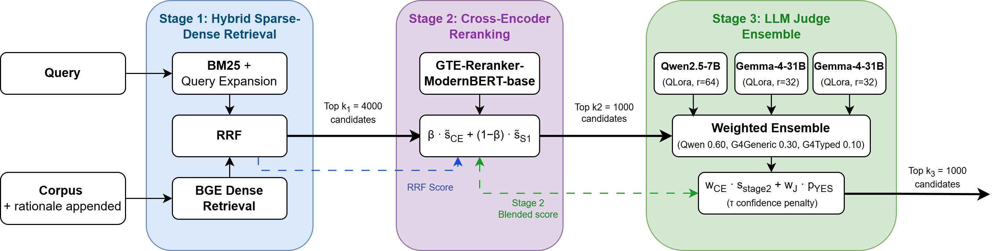

<div align="center">

# IROH: Insightful Ranking Of Humor 
### JOKER Lab at CLEF 2026, Task 1 English - Team VANGUARD


[Ana-Maria Luisa Mocanu](https://scholar.google.com/citations?user=Kw4_jBMAAAAJ&hl=en), [Sebastian Mocanu](https://scholar.google.com/citations?user=osyBED4AAAAJ&hl=en),
[Ciprian-Octavian Truică](https://scholar.google.com/citations?user=ZOKqr-QAAAAJ&hl=en), [Elena-Simona Apostol](https://scholar.google.com/citations?user=XUZcjpEAAAAJ&hl=en)

[](https://When-Paper-Appears-it-Will-Work.com)
[](https://ds4ai-upb.github.io/VANGUARD-CLEF2026-JOKER/)
[](https://arxiv.org/abs/WIP)
[](#citation)


[](LICENSE)
[](https://www.python.org/downloads/)

**Ranked 1st** on the JOKER 2026 Task 1 English leaderboard with **0.6347 MAP**.
</div>

## Overview

IROH (Insightful Ranking of Humor) tackles the dual requirement of JOKER Task 1: a system must be aware of both **semantic relevance** to a query and the **linguistic typology** that makes a text humorous. Given a natural-language query describing a humor topic, it retrieves the relevant jokes, puns, and wordplay from a balanced corpus of humorous and non-humorous texts.

The pipeline has tree stages:
1. **Hybrid sparse-dense retrieval:** BM25 with query expansion, fused with BGE dense embeddings via Reciprocal Rank Fusion (RRF) to cast a wide first-stage net (top $k_1 = 4000$)
2. **Cross-encoder reranking:** A finetuned GTE-Reranker-ModernBERT-Base rescores candidates, blended with the carried-forward RRF score (top $k_2 = 1000$)
3. **LLM judge ensemble:** Three LoRA-adapted judges one Qwen2.5-7B and two Gemma-4-31B finetuned on generic and typed rationales which emit soft YES/NO scores, combined by weighted voting into the final ranking.

Training data is build with **rationale distillation**: Gemma 4 generates query-aware, one-sentence rationales and up to four types of structured hard negatives, under two prompt strategies (i.e., generic and typed).

<div align="center">
  
  <br>
  <em>Figure 1: Overview of the IROH three-stage retrieval pipeline.</em>
</div>


---

## Results 
IROH reaches **0.6347 MAP**, a substantial advance over prior editions of the task (the corpus expanded across editions, so figures are indicative of progress rather than a strictly controlled benchmark):

| System                                   | JOKER edition | MAP        |
|------------------------------------------|---------------|------------|
| Best official run Task 1 English         | 2024 Task 1   | 0.12       |
| Best English run (Qwen filter-explainer) | 2025          | 0.3501     |
| **IROH (ours) Task 1 English**           | **2026**      | **0.6347** |


### Our findings

1. **The judge is the dominant signal.** The rationale-distilled LLM judge drives ranking quality. Appending rationales to the first-stage BM25 index has a negligible effect (0.2876 vs. 0.2868 MAP with the judge distilled).
2. **Structured hard negatives hurt generalisation.** Augmentation inflates local-validation scores but degrades official performance in nearly every configuration. A distribution-shift effect between the local split and the broader task.
3. **Lighter, better-calibrated models perform better.** The Qwen2.5-7B judge on generic rationales (0.6055 MAP) beats every Gemma-4-31B configuration, and `bge-base-en-v1.5` with 768-dim outperforms `bge-en-icl` with 4096-dim inside the full pipeline. Finetuning quality and data composition matter at least as much as raw model capacity.
4. **Generic rationales are better.** The simpler generic prompt produces more consistent supervision than the structured typed prompt, with the advantage concentrated in the smaller model.

---

## Naming paper terms to code
 
The paper's two rationale strategies map to code suffixes as follows:
 
| Paper term  | Code suffix  | Rationale script          | Negatives script              | Rationale file                   | Augmented file                  |
|-------------|--------------|---------------------------|-------------------------------|----------------------------------|---------------------------------|
| **generic** | `old`        | `step1_old_rationales.py` | `step2_old_hard_negatives.py` | `old_temp_step1_rationales.json` | `old_temp_step2_augmented.json` |
| **typed**   | `new` / none | `step1_rationales.py`     | `step2_hard_negatives.py`     | `temp_step1_rationales.json`     | `temp_step2_augmented.json`     |

---

## Setup
Install [UV](https://docs.astral.sh/uv/) package manager and run:
```bash
uv sync
```

Or use pip in a virtual environment:
```bash
python -m pip install install -r requirements.txt

python -m pip install -e . # needed to run scripts in runnable/
```

Either command installs `iroh` (from `src/`) in editable mode, so the package is importable and the entry points in `runnable/` work from anywhere.

Rationale/negative generation (Steps 1–2) needs a local **[Ollama](https://ollama.com/)** server with the Gemma 4 model pulled:

```bash
ollama pull gemma4:e4b
```

### Hardware used
 
| Component                | GPU              |
|--------------------------|------------------|
| Judge finetuning (QLoRA) | NVIDIA A100 80GB |
| Cross-encoder finetuning | NVIDIA RTX 4090  |


## Data

We use official JOKER files in `data/` combining the 2025 and 2026 editions and deduplicating. 

**They are not provided in this repository.**

All paths are centralized in [path_manager.py](src/iroh/core/path_manager.py).

---

## How to run

The workflow is two parts: **(A)** generate training data with Ollama (manual, done once), then **(B)** run everything else with [run_all.py](runnable/run_all.py).

### A. Generate rationales + hard negatives (Ollama)

[run_all.py](runnable/run_all.py) does **not** do this step. Run it first. Because both the generic and typed scripts default to the *same* `temp_*.json` filenames, you must redirect the `old`/generic outputs explicitly.

```bash
# balanced train set + train/test split
python runnable/data_processing.py

# TYPED (new)
python runnable/step1_rationales.py                     
python runnable/step2_hard_negatives.py                 

# GENERIC (old) 
python runnable/step1_old_rationales.py --output data/old_temp_step1_rationales.json
    
python runnable/step2_old_hard_negatives.py \
    --input  data/old_temp_step1_rationales.json \
    --output data/old_temp_step2_augmented.json
```

Alternatively you can use `uv run` instead of `python`:
```bash
uv run runnable/data_processing.py
```

Both steps support resume (progress is saved every 25-50 items) and `--model` / `--workers` flags.

### B. Run the full pipeline

```bash
python runnable/run_all.py                 # everything 
python runnable/run_all.py --dry-run       # print the plan, run nothing
python runnable/run_all.py --from-stage 3  # resume from judge training
python runnable/run_all.py --only 7 9      # just the ablation + top-30 submissions
python runnable/run_all.py --skip 7        # skip the ablation
```

Stages:

| #  | Stage                                                      | Script                     |
|----|------------------------------------------------------------|----------------------------|
| 1  | Data processing (corpus, balanced sampling, splits, plots) | `data_processing.py`       |
| 2  | Train cross-encoders (3 backbones with/out aug)            | `train_cross_encoder.py`   |
| 3  | Train judges (Qwen2.5-7B + Gemma-4-31B on 4 data variants) | `train_judge_gemma4.py`    |
| 4  | Score corpus humor prior (WIP, not used)                   | `score_corpus_humor.py`    |
| 5  | Precompute dense embeddings                                | `precompute_embeddings.py` |
| 6  | Local evaluation (held-out split)                          | `pipeline.py`              |
| 7  | Ablation (every CE with Judge combo)                       | `ablation.py`              |
| 8  | Publication plots                                          | `evaluate_plots.py`        |
| 9  | CodaBench top-N submissions -> `prediction.zip`            | `pipeline.py --top-n`      |
| 10 | Ensemble weight ablation (CPU-only)                        | `ensemble_ablation.py`     |

---

## Running pieces on their own

```bash
# Cross-encoders / judges (all configs, or one by index)
python runnable/train_cross_encoder.py            # all 6 CE configs
python runnable/train_cross_encoder.py --config 0 # one config
python runnable/train_judge_gemma4.py --qwen      # only the 4 Qwen judges
python runnable/train_judge_gemma4.py --gemma     # only the 4 Gemma judges

# One pipeline run
python runnable/pipeline.py                                   # local eval, best CE+judge auto-picked
python runnable/pipeline.py --ce CE_GTE_new --judge Judge_Qwen7B_old
python runnable/pipeline.py --submission                      # all official test queries
python runnable/pipeline.py --no-judge                        # Stages 1–2 only

# Targeted ablations
python runnable/rationale_stage12_ablation.py --ce CE_GTE_new # rationale effect, judge OFF
python runnable/ensemble_ablation.py --blend-only             # ensemble sanity check

# Hyperparameter search (greedy, S1 -> S2)
python runnable/run_search.py --phase 1                       # Stage-1 grid (BM25/RRF/topk/QE)
python runnable/run_search.py --phase 2                       # Stage-2 grid (CE blend/dedup/topk)
python runnable/run_search.py --embedder-search               # compare 4 BGE-family embedders
```

> Note: Training scripts are **resumable**: a finished model (or an `early_stopped.flag`) is skipped, and a partial HuggingFace checkpoint is resumed automatically.

---

## Config quick reference (`config.py`)

- `DENSE_MODEL`: dense retriever (`bge-base-en-v1.5`).
- `CE_CANDIDATES` / `CE_TRAIN_CONFIGS`: the 6 cross-encoder configs.
- `JUDGE_CANDIDATES` / `JUDGE_TRAIN_CONFIGS`: the 8 judge configs (`_new`/`_old` with/out `_aug`).
- `STAGE1_TOPK`, `STAGE2_TOPK`, `STAGE3_TOPK`, `CE_WEIGHT`, `JUDGE_WEIGHT`, `JUDGE_THRESHOLD`: pipeline knobs.

### Final submission configuration
 
| Component        | Value                                           |
|------------------|-------------------------------------------------|
| Dense embedder   | `bge-base-en-v1.5`                              |
| Cross-encoder    | GTE-Reranker-ModernBERT-Base (no augmentation)  |
| Pool sizes       | $k_1$ = 4000, $k_2$ = 1000, $k_3$ = 1000        |
| CE / judge blend | 0.30 / 0.70                                     |
| Ensemble weights | Qwen 0.60, Gemma-generic 0.30, Gemma-typed 0.10 |
| Penalty          | τ = 0.30, λ = 0.85 (no measurable effect)       |


## Citation
**WIP: Placeholder until the official proceedings entry is available:**
```bibtex
@InProceedings{Ana_Maria_Luisa_Mocanu_2026_IROH_CLEF,
    author    = {Mocanu, Ana-Maria Luisa and Mocanu, Sebastian and Truică, Ciprian-Octavian and Apostol, Elena-Simona},
    title     = {IROH: Insightful Ranking Of Humor using Multi-Stage Hybrid Retrieval with Rationale-Distilled LLM Judges for JOKER 2026 Track Task 1 English},
    booktitle = {Conference and Labs of the Evaluation Forum (CLEF), Joker 2026 Track Task 1 English},
    month     = {June},
    year      = {2026}
}
```


## License
 
Released under the [MIT License](LICENSE).
